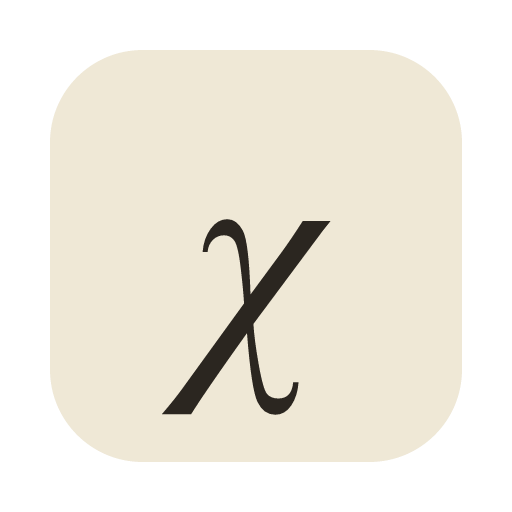
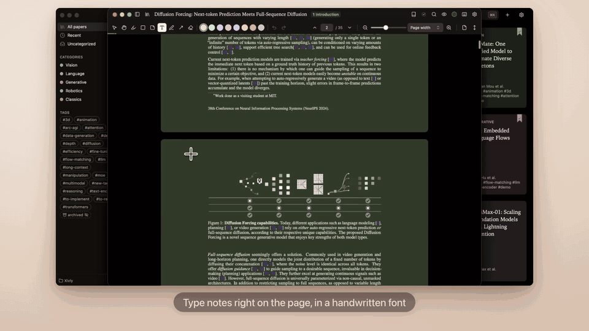

<p align="center"></p>

<h1 align="center">Xivly</h1>
<p align="center"><em>Papers, without distraction.</em></p>

<p align="center">
  <a href="https://github.com/julien-blanchon/xivly/releases/download/v0.5.0/Xivly-demo.mp4"></a>
  <br><sub><a href="https://github.com/julien-blanchon/xivly/releases/download/v0.5.0/Xivly-demo.mp4">▶ Watch the 2-minute tour</a></sub>
</p>

A calm reader for research papers: read, annotate and organize your PDFs. Free and open source, on Mac, Windows, Linux, the web and Chrome. No account, no tracking: your library is a folder of plain files.

## Features

- **Annotate:** highlight, box, draw, add arrows and comments, pin emoji notes, and write on the page in a handwritten font. Number keys pick the color (or the note's emoji).
- **Notes stay in the PDF:** annotations are standard PDF annotations, so a shared paper opens with your notes in Preview, Acrobat or any PDF app. Export your notes as Markdown, copy a BibTeX entry.
- **Never lose your place:** hover a citation, a figure, a table or an equation to preview it; jump to every place an equation is mentioned and back. Right-click an equation or figure to box it, copy it or save it as an image.
- **Find your way around a paper:** side panels for contents, pages, figures, tables, equations, references and your notes; find in the paper with every match listed.
- **Add papers in one step:** search Hugging Face or paste an arXiv link, drop PDFs, or right-click a paper on the web: *Open in Xivly* (Chrome extension). Titles, authors, links to code, project pages and Hugging Face models and Spaces are filled in for you.
- **Organize:** categories, tags, read / unread, archive, sort and search across your library.
- **Read comfortably:** reading themes that tint the page by category, light and dark, one page, two pages or scroll sideways, and it reopens where you left off. A keyboard shortcut for everything (`?` lists them).
- **Yours, as plain files:** each paper is a folder with `paper.pdf` and `paper.json`, in any folder you choose (iCloud Drive, Dropbox, a git repo…). Scripts and coding agents can read and extend it (below).

## Install

| | |
|---|---|
| **macOS** 26.2+ | `brew install --cask julien-blanchon/tap/xivly`, or the `.dmg` from [Releases](https://github.com/julien-blanchon/xivly/releases). Signed and notarized. |
| **Windows** 10/11 | the `.exe` (or `.msi`) from [Releases](https://github.com/julien-blanchon/xivly/releases). Not code-signed yet: SmartScreen asks once (*More info → Run anyway*). |
| **Linux** x86_64 | `curl -fsSL https://raw.githubusercontent.com/julien-blanchon/xivly/main/install.sh \| sh` (picks the `.deb`, `.rpm` or AppImage for your system and checks it), or download one from [Releases](https://github.com/julien-blanchon/xivly/releases). Needs glibc 2.39+ (Ubuntu 24.04, Debian 13, Fedora 40 or newer). |
| **Web** | [julien-blanchon.github.io/xivly](https://julien-blanchon.github.io/xivly), in a recent Chrome, Edge, Arc or Safari 26.2. |
| **Chrome extension** | [Chrome Web Store](https://chromewebstore.google.com/detail/xivly/ckcfikoohhefehgbgngopbbiidnhalpi) (Chrome, Edge, Brave, Arc 145+): the web app, plus *Open in Xivly* on arXiv pages and PDF links. |

Updates: `brew upgrade --cask xivly` on macOS, re-run the install line on Linux, otherwise download the new release (there is no auto-update).

## Your library is a folder

Xivly only writes plain files in the folder you pick:

```
<library>/
  AGENTS.md / CLAUDE.md       explains the layout to Claude Code, Codex, …
  .xivly/library.json         categories and tags
  .xivly/hooks/               your scripts, run on events (desktop)
  papers/<year>-<title>/
    paper.pdf                 your annotations live inside the PDF
    paper.json                title, authors, year, abstract, DOI, arXiv, links, category, tags
```

Open the folder in Claude Code and ask it about your papers and highlights. Unknown fields in `paper.json` are kept, so agents and scripts can add their own.

**Hooks (desktop):** drop a script named after an event in `.xivly/hooks/` (`paper-added`, `paper-saved`, `paper-updated`, `paper-removed`; `paper-added.py` works too). It runs in the paper's folder with `paper.json` on stdin; output goes to `.xivly/logs/hooks.log`. Executables or `.sh` on macOS and Linux, `.ps1`, `.cmd` or `.bat` on Windows. Xivly never writes hook scripts itself (only a `.sample`), so enabling one is always your choice.

## More

- [DEVELOPMENT.md](DEVELOPMENT.md): architecture, running and testing it, the Chrome extension, the example library, releases.
- [RELEASING.md](RELEASING.md): the release workflow and store publishing.
- [PRIVACY.md](PRIVACY.md) · [CODE_SIGNING.md](CODE_SIGNING.md)
- The PDF engine is [svelte-pdf-mini](https://github.com/julien-blanchon/svelte-pdf-mini), by the same author.

MIT License.
